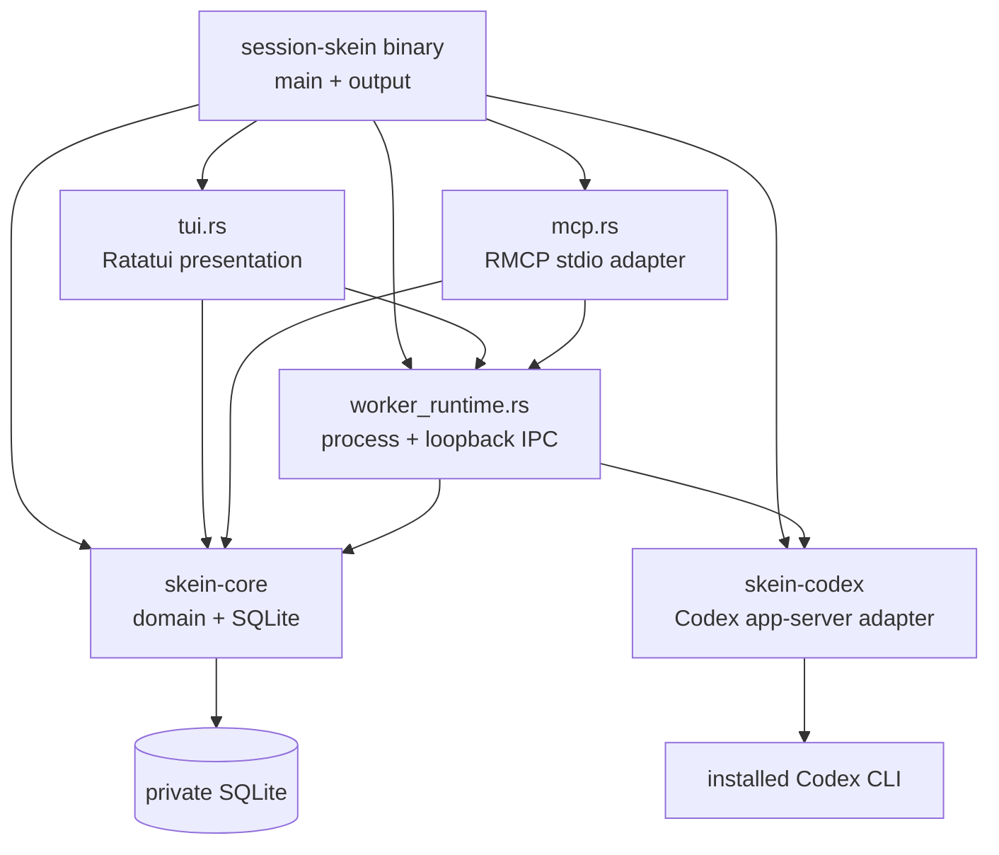
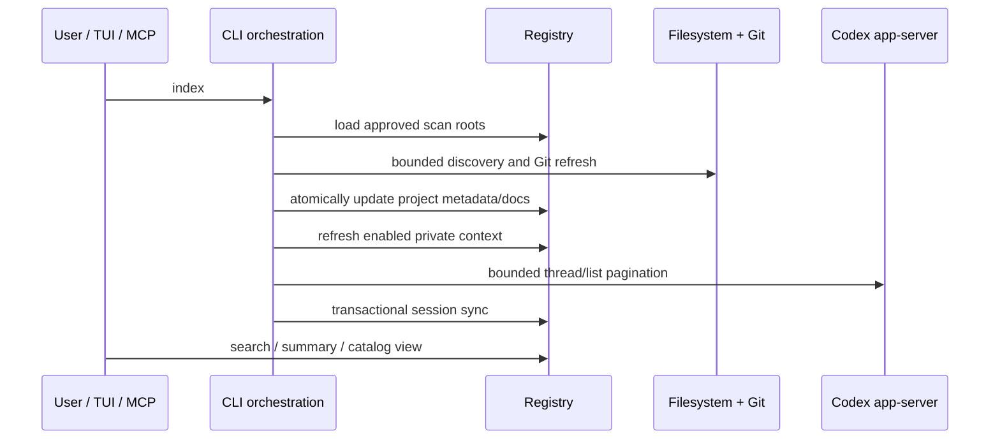

# Codebase map

This page is the guided architectural map for contributors and installing agents. It
describes responsibilities and relationships; the source remains authoritative for
exact behavior.

## Guided tour

1. Start at [`crates/skein-cli/src/main.rs`](../crates/skein-cli/src/main.rs) to see
   the public command model and orchestration.
2. Follow state into [`skein-core`](../crates/skein-core/src/lib.rs), where paths,
   registry migrations, projects, recall, sessions, runs, and worker policy live.
3. Follow Codex protocol calls into
   [`skein-codex`](../crates/skein-codex/src/lib.rs), the only crate that speaks
   app-server JSON-RPC.
4. Return to [`worker_runtime.rs`](../crates/skein-cli/src/worker_runtime.rs) for
   detached ownership and authenticated loopback IPC.
5. Compare the two presentation adapters:
   [`tui.rs`](../crates/skein-cli/src/tui.rs) and
   [`mcp.rs`](../crates/skein-cli/src/mcp.rs). Neither owns a second state machine.
   [`indexing.rs`](../crates/skein-cli/src/indexing.rs) is the shared CLI/MCP index
   orchestration and scope boundary.

## Crate dependency map



`skein-core` never spawns Codex. `skein-codex` does not own Session Skein's durable
domain model. The binary crate composes them.

## Core module map

| Module | Owns | Depends on / feeds |
| --- | --- | --- |
| [`paths.rs`](../crates/skein-core/src/paths.rs) | Platform config/data path discovery and overrides | Registry, worker runtime, installers via `doctor` |
| [`registry.rs`](../crates/skein-core/src/registry.rs) | SQLite open modes, schema migrations, projects, Git snapshots | Every durable feature |
| [`scan.rs`](../crates/skein-core/src/scan.rs) | Scan-root policy, recursive discovery, exclusions, provenance | Project registry and `index` |
| [`git.rs`](../crates/skein-core/src/git.rs) | Bounded Git fingerprint and metadata observation | Project cards, activity, routing |
| [`freshness.rs`](../crates/skein-core/src/freshness.rs) | Read-only age and coverage projection over existing observations | CLI freshness and MCP activity status |
| [`recall.rs`](../crates/skein-core/src/recall.rs) | Bounded project identity documents and FTS | Search and project matching |
| [`context.rs`](../crates/skein-core/src/context.rs) | Defaults-off snippets, verified JSONL tail reuse, and FTS | Deep-context search and global index reports |
| [`session.rs`](../crates/skein-core/src/session.rs) | Source-neutral thread metadata and project binding | Recovery, routing, summaries |
| [`insight.rs`](../crates/skein-core/src/insight.rs) | Ranked scoring evidence, stable route selectors, project cards, day summaries | `match`, `summary`, conductor plan |
| [`control.rs`](../crates/skein-core/src/control.rs) | Policies, runs, turns, actions, events, reconciliation | Foreground and worker control |
| [`worker.rs`](../crates/skein-core/src/worker.rs) | Leases, fencing, ownership, mutation plans | Detached worker runtime |
| [`conductor.rs`](../crates/skein-core/src/conductor.rs) | Atomic automatic or explicitly selected route receipt and fail-closed dispatch plan | CLI, TUI, MCP conduct paths |

## Main data flows

### Index and search



### Conduct and recover

```mermaid
sequenceDiagram
    participant U as User / MCP / TUI
    participant K as Conductor
    participant DB as Registry transaction
    participant W as Skein worker
    participant X as Codex app-server

    U->>K: private stdin prompt + authority + UUID
    K->>K: read-only explainable match
    K->>X: ChatGPT authentication preflight
    K->>DB: recompute route and record receipt/policy/run/lease
    DB-->>K: committed unique route
    K->>W: spawn exact claimed run
    W->>X: start/resume thread and turn
    X-->>W: live events
    W-->>U: bounded redacted events
    Note over W,DB: lost worker is fenced; no automatic replay
    U->>X: exact read during reconcile
    U->>DB: record terminal evidence or recovery-required state
```

## Presentation layers

- `main.rs` provides stable human, JSON, and JSONL command contracts.
- `tui.rs` renders snapshots and invokes bounded child commands away from the render
  loop.
- `mcp.rs` exposes 24 tools with annotations, setup-required responses, and an
  optional control capability.
- `output.rs` keeps human-readable output separate from machine-readable structures.

All three surfaces reuse the same registry and worker policy. A feature implemented
only inside one presentation adapter is a design smell.

## Trust boundaries

```text
untrusted repository text ----> bounded index ----> bounded snippets
Codex-owned transcripts ------> explicit opt-in -> bounded snippets
private user prompt ----------> stdin/IPC only ---> Codex turn
MCP annotations --------------> client UX hint (not authority)
full-access acknowledgement --> immutable policy receipt
```

Read [privacy](privacy.md) for data limits and [architecture](architecture.md) for
state-machine details.

## Where to make a change

| Change | Primary location | Also update |
| --- | --- | --- |
| Add a CLI command | `skein-cli/src/main.rs` | CLI reference, integration tests |
| Add an MCP tool | `skein-cli/src/mcp.rs` | MCP reference, skill if workflow changes |
| Change durable schema | `skein-core/src/registry.rs` | migration tests, maintenance docs |
| Change discovery policy | `skein-core/src/scan.rs` | indexing guide, privacy tests |
| Change private recall | `skein-core/src/context.rs` | context guide, privacy docs |
| Change matching | `skein-core/src/insight.rs` / `conductor.rs` | evidence tests, conductor docs |
| Change Codex protocol | `skein-codex/src/lib.rs` | protocol fixtures, control/session docs |
| Change worker ownership | `skein-core/src/worker.rs` + `worker_runtime.rs` | recovery tests and workers guide |
| Change TUI behavior | `skein-cli/src/tui.rs` | TUI key/reference docs |
| Change installation | `install.sh`, `install.ps1`, plugin tree | install smoke tests and INSTALL.md |
