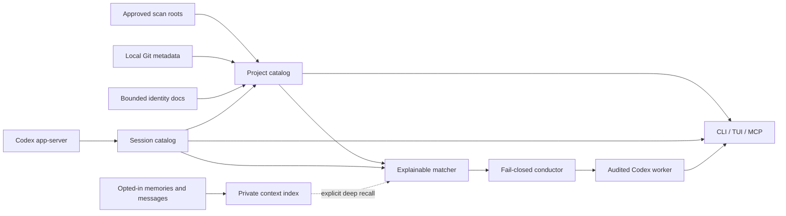

# Concepts and glossary

Session Skein separates identity, observation, recall, and control so a convenient
global entry point does not become an implicit authority boundary.

## System model

## Identity versus deep context

The project-document index reads a small bounded set of Git-tracked README variants,
`AGENTS.md`, manifests, and top-level documentation. It answers “what project is
this?” and is refreshed by `skein index`.

The private context index is different. It can ingest generated Codex memory
summaries or raw user/assistant messages only after separate opt-ins. Raw sessions
must also have a canonical existing cwd beneath an approved scan root. Search results
are bounded snippets; full source documents are never returned.

## Observation versus control

Observation reads or records facts: project paths, Git heads, session identity,
worker state, and redacted events. Control starts or changes Codex work. Control is
available only through explicit CLI flags or an MCP server started with
`--allow-control`, and each dispatch still records immutable policy and authority.

MCP annotations help clients present approvals. They are not authorization by
themselves.

## Source ownership

| Data | Owner/source of truth | What Skein stores |
| --- | --- | --- |
| Repository contents | Local filesystem and Git | Bounded identity text and metadata |
| Codex thread/turn content | Codex | Metadata by default; bounded snippets only after opt-in |
| Project relationships | Session Skein | Canonical project/session links |
| Runs, actions, worker leases | Session Skein | Content-free audit and recovery state |
| Live model output | Codex connection | Redacted bounded event window; no prompt/output transcript |

## Glossary

**Project**
: One canonical existing directory explicitly registered or discovered beneath an
  approved scan root. It is the unit used for routing, Git metadata, identity docs,
  session association, and summaries.

**Scan root**
: A persisted authorization to inspect one directory exactly or recursively to a
  bounded depth. A scan root is not itself necessarily a project.

**Index**
: The coordinated bounded refresh of discovery, Git metadata, project identity
  documents, enabled context sources, and Codex session metadata.

**Session / thread**
: A source-owned conversation identity. Codex calls it a thread. Skein stores opaque
  IDs and metadata without claiming ownership of the transcript.

**Run**
: One Skein-owned control attempt with an immutable policy snapshot, selected project
  and optional thread, actions, events, and terminal or recovery state.

**Turn**
: One Codex request inside a thread. A Skein run records the exact source turn it
  controls or reconciles.

**Worker**
: A per-run background Skein process that owns a Codex stdio connection. It survives
  the starting client, uses a fenced lease and authenticated loopback capability, and
  exits after terminal idle time. It is not a global daemon.

**Conductor**
: The single-prompt decision and dispatch path. It recomputes the route inside the
  audited transaction and refuses ambiguous or changed evidence.

**Match**
: A read-only ranked recommendation with explicit scoring evidence. Recency may
  strengthen a lexical or exact-identity match but cannot nominate a project alone.

**Deep context**
: Defaults-off generated memories or raw session messages. MCP calls must request it
  explicitly because returned snippets enter model context.

**Reconciliation**
: A read of the exact source thread/turn after a worker is lost. It can durably record
  terminal evidence and close a run, but it never replays work or takes over an
  in-progress turn.

**Agent Deck / tmux**
: Optional future observers. Neither owns Session Skein state nor participates in the
  first-class Codex path today.

## Invariants

- No registered project means no inferred permission to scan arbitrary directories.
- No unique route means no conductor dispatch.
- No full-access acknowledgement means no Codex mutation.
- A lost response plus a repeated request UUID means status lookup, not prompt replay.
- Unavailable sources retain the last complete index rather than publishing partial
  state.
